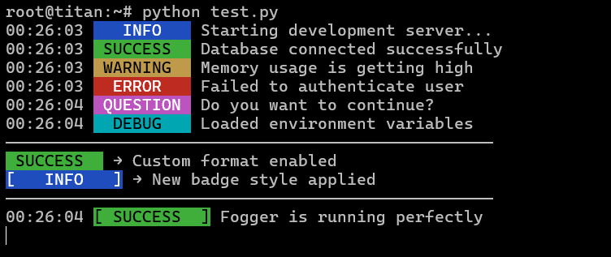

# Fogger

Modern, colorful and fully customizable logging for Python.

<p align="center">
  
</p>

---

## Features

- Zero dependencies
- Beautiful terminal output
- Fully customizable format system
- Custom badge styles
- ANSI color support
- Lightweight and fast
- Windows & Linux support
- Clean developer experience

---

## Installation

```bash
pip install fogger
```

---

## Quick Example

```python
from fogger import log


log.info("Starting development server...")
log.success("Database connected successfully")
log.warning("Memory usage is getting high")
log.error("Failed to authenticate user")
log.question("Do you want to continue?")
log.debug("Loaded environment variables")
```

---

## Output

```
text
16:21:08  INFO     Starting development server...
16:21:08  SUCCESS  Database connected successfully
16:21:08  WARNING  Memory usage is getting high
16:21:08  ERROR    Failed to authenticate user
16:21:08  QUESTION Do you want to continue?
16:21:08  DEBUG    Loaded environment variables
```

---

## Custom Formatting

Fogger allows you to fully customize log output.

```python
from fogger import log

log.set_format("{badge} → {message}")

log.success("Custom format enabled")
```

Output:

```
text
 SUCCESS  → Custom format enabled
```

---

## Custom Badge Style

```python
from fogger import log

log.set_badge_style("[ {label:^8} ]")

log.info("New badge style applied")
```

Output:

```
text
[   INFO   ] New badge style applied
```

---

## Available Variables

| Variable | Description |
|----------|-------------|
| {time} | Current time |
| {badge} | Colored badge |
| {level} | Log level |
| {message} | Log message |

---

## Log Types

```python
log.info("Information")
log.success("Success")
log.warning("Warning")
log.error("Error")
log.question("Question")
log.debug("Debug")
```

---

## Utilities

### Line

```python
log.line()
```

### Space

```python
log.space()
```

---

## Example

```python
from fogger import log


log.info("Server starting...")
log.success("API connected")

log.line()

log.set_format("{time} {badge} → {message}")

log.warning("Custom formatting enabled")
```

---

## Why Fogger?

- Clean terminal aesthetics  
- Full customization  
- No dependencies  
- Fast & lightweight  
- Developer-friendly  

---

## Author

Made with love by **55e5**

GitHub: https://github.com/qw97-alt

---

## License

MIT